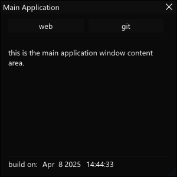
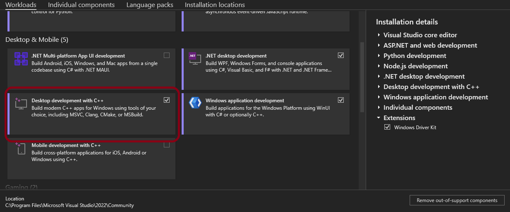

# ImGui AppKit

This is a simple project template that you can use to quickly start developing simple, single-window & multi-window GUI apps for [Microsoft Windows](https://www.microsoft.com/en-us/windows). It uses [Dear ImGui library](https://github.com/ocornut/imgui) and heavily utilizes its [multi-viewports functionality](https://github.com/ocornut/imgui/wiki/Multi-Viewports).

**Note:** An `enhanced` version of the original [ImGui AppKit](https://github.com/SamuelTulach/ImGui-AppKit) by Samuel Tulach, including fixes (e.g., taskbar icon, CPU usage) and modern C++ updates (e.g., smart pointers) and a refactored window manager.

**Pros:**

* Compiles into a single small .exe file with zero dependencies.*
* If you are familiar with [Dear ImGui](https://github.com/ocornut/imgui), you will be able to get from concept to working app in a matter of minutes.
* Includes fixes and improvements over the original version.

**Cons:**

* Since [Dear ImGui](https://github.com/ocornut/imgui) is an immediate-mode GUI library, your GPU will need to constantly re-render frames even if nothing changes (though optimizations have been made to reduce unnecessary CPU load in the main loop).

**\* DirectX 11 comes preinstalled on Windows 10+, MFC static linking required.**

## Screenshots

Those two example windows are implemented in the project.

 

## Compiling

1.  Download [Visual Studio 2022](https://visualstudio.microsoft.com/vs/) (Community Edition is fine).
2.  When installing, select "Desktop development with C++."

    
3.  Clone this repository.
4.  Open the `.sln` file and compile the solution (Build > Build Solution).

---

## Acknowledgements

This project is based on the excellent work of **Samuel Tulach**.

* **Original Author:** Samuel Tulach
* **Original Repository:** [https://github.com/SamuelTulach/ImGui-AppKit](https://github.com/SamuelTulach/ImGui-AppKit)

We thank Samuel for providing the initial foundation for this useful application kit.
